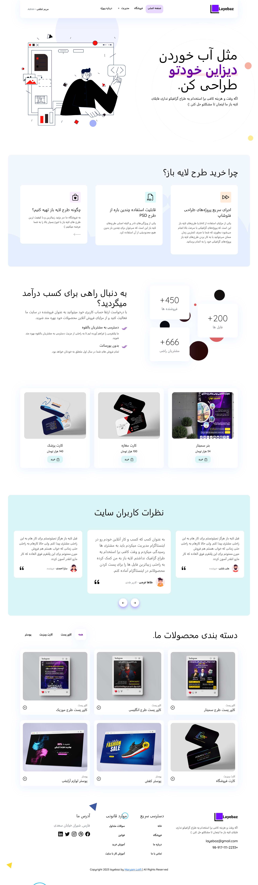
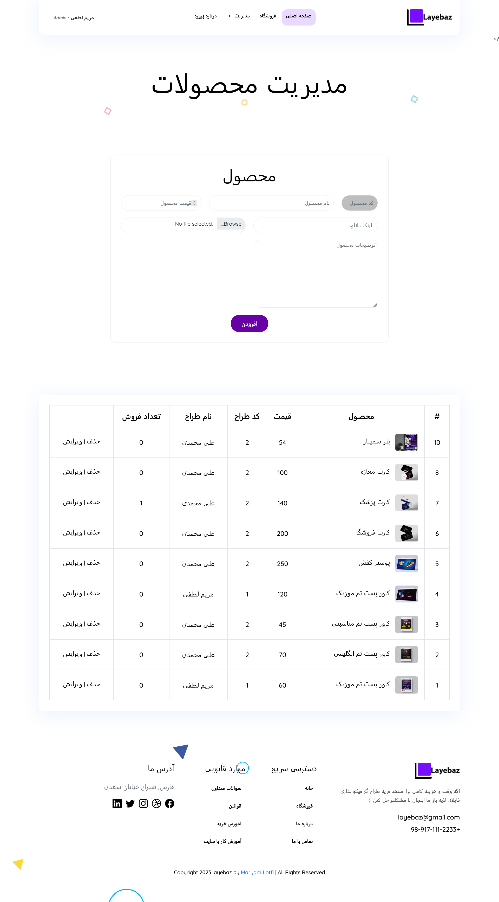

### Layebaz is a website with vanilla php for practicing PHP

###### Technologies

- HTML,Css
- jQuery
- Bootstrap grids for responsive
- OWl Slider
- PHP

###### What it does

- Has three types of users (admin and public and seller)
- Signup , Login
- Showing products and their detailes
- Managing products (add,delete,edit)
- Managing users
- Managing bought products

###### Install

Nothing too fancy just import the db and run it on your local srver :)

###### Code Description Video

[Description Video](https://drive.google.com/file/d/1wnN3WhGeclwwz9037xPPPAivZsMwqat6/view?usp=share_link).

###### Images

Index

Manage-Product

